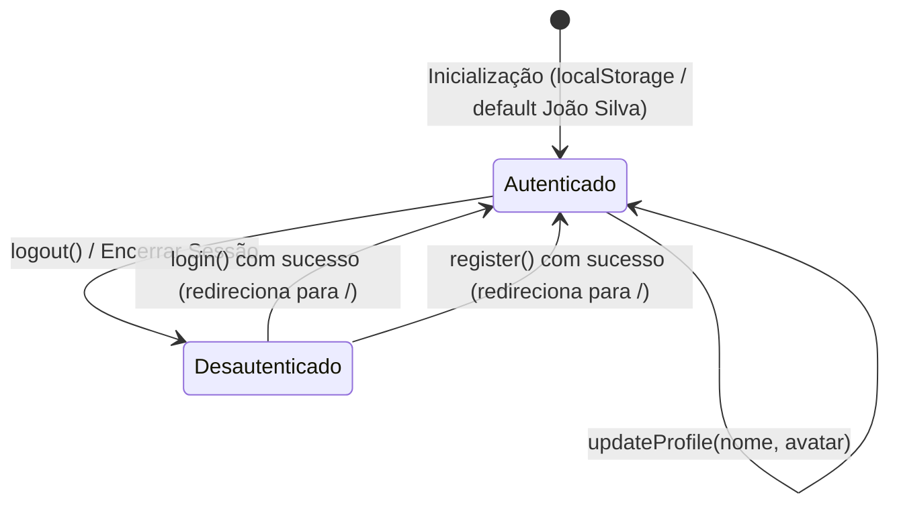

# Data Model: Telas de Autenticação e Perfil do Usuário

**Feature**: `SDB-82-signin-profile`
**Date**: 2026-10-07
**Status**: Ready

## 1. Visão Geral

Este documento define os tipos, entidades de dados, validações e ciclos de estado para os fluxos de autenticação (Login, Cadastro e Recuperação de Senha) e para a página de Perfil do Estudante do Sidebrain Frontend.

---

## 2. Entidades de Autenticação (`src/types/auth.ts`)

### 2.1. Credenciais de Login (`LoginCredentials`)

Representa as informações informadas pelo usuário para acessar a plataforma.

```typescript
export interface LoginCredentials {
  email: string
  password: string
  rememberMe: boolean
}

export interface LoginFormValidationErrors {
  email?: string
  password?: string
  general?: string
}
```

**Regras de Validação**:
- `email`: Obrigatório, formato de e-mail válido (`/^[^\s@]+@[^\s@]+\.[^\s@]+$/`).
- `password`: Obrigatória, não vazia.
- `rememberMe`: Opcional (padrão: `false`).

---

### 2.2. Dados de Cadastro (`RegisterFormData`)

Representa o formulário de registro de novos estudantes.

```typescript
export interface RegisterFormData {
  name: string
  email: string
  password: string
  termsAccepted: boolean
}

export interface PasswordCriteriaStatus {
  minLength: boolean  // 8+ caracteres
  hasNumber: boolean   // pelo menos 1 número
  hasSymbol: boolean   // pelo menos 1 símbolo (!@# etc)
}

export type PasswordStrengthLevel = 'fraca' | 'media' | 'forte'

export interface RegisterFormValidationErrors {
  name?: string
  email?: string
  password?: string
  termsAccepted?: string
}
```

**Regras de Validação**:
- `name`: Obrigatório, mínimo de 2 caracteres, sem apenas espaços em branco.
- `email`: Obrigatório, formato de e-mail válido.
- `password`:
  - Mínimo de 8 caracteres.
  - Pelo menos 1 número (`/\d/`).
  - Pelo menos 1 símbolo especial (`/[!@#$%^&*(),.?":{}|<>]/`).
  - Nível de força:
    - 0-1 critérios atendidos: `'fraca'` (1 barra preenchida em vermelho/âmbar).
    - 2 critérios atendidos: `'media'` (2 barras preenchidas em amarelo/azul).
    - 3 critérios atendidos: `'forte'` (3 barras preenchidas em verde/azul).
- `termsAccepted`: Obrigatório ser `true` para submissão.

---

### 2.3. Solicitação de Recuperação de Senha (`PasswordRecoveryData`)

Representa o estado do formulário de recuperação de senha.

```typescript
export interface PasswordRecoveryFormData {
  email: string
}

export interface PasswordRecoveryState {
  email: string
  isSubmitted: boolean
  isLoading: boolean
  error?: string
}
```

**Regras de Validação e Transição**:
- `email`: Obrigatório, formato de e-mail válido.
- `isSubmitted`: Transiciona de `false` para `true` após validação do e-mail e clique em "Enviar Link de Recuperação", alternando o card para a visualização de confirmação de envio.

---

## 3. Entidades de Perfil e Sessão (`src/types/userProfile.ts`)

### 3.1. Perfil do Estudante (`UserProfile`)

Centraliza os dados de identificação, plano e progresso de nível do usuário.

```typescript
export interface UserProfile {
  id: string
  name: string
  email: string
  avatarUrl: string
  planTier: 'MEMBRO PRO' | 'GRATUITO'
  level: number
  currentXp: number
  nextLevelXp: number
  memberSince: string
}
```

**Valores Padrão Mockados (SDB-82)**:
- `id`: `'u-01'`
- `name`: `'João Silva'`
- `email`: `'joao@exemplo.com'`
- `avatarUrl`: imagem de demonstração (avatar com selo dourado de estrela)
- `planTier`: `'MEMBRO PRO'`
- `level`: `8`
- `currentXp`: `850`
- `nextLevelXp`: `1000`
- `memberSince`: `'Jan 2025'`

---

### 3.2. Trilhas Ativas de Aprendizagem (`ActiveTrack`)

Representa as trilhas em andamento exibidas no perfil do estudante.

```typescript
export type TrackCategory = 'Idiomas' | 'Exatas' | 'Tecnologia' | 'Humanas'

export interface ActiveTrack {
  id: string
  title: string
  category: TrackCategory
  categoryColor: string
  progressPercent: number
  description: string
  nextLessonTitle: string
  targetRoute: string
}
```

**Instâncias Mockadas (SDB-82)**:
1. **Língua Japonesa (N5 Básico)**:
   - `category`: `'Idiomas'` (badge lilás)
   - `progressPercent`: `40`
   - `description`: `'Gramática elementar, partículas essenciais e Hiragana/Katakana.'`
   - `nextLessonTitle`: `'Partículas: は, が e を'`
   - `targetRoute`: `'/lessons/1'`
2. **Matemática do Zero (Geometria Plana)**:
   - `category`: `'Exatas'` (badge verde-água)
   - `progressPercent`: `65`
   - `description`: `'Teoremas de Euclides, relações métricas e áreas fundamentais.'`
   - `nextLessonTitle`: `'Trigonometria no Triângulo Retângulo'`
   - `targetRoute`: `'/lessons/2'`

---

### 3.3. Badges em Destaque (`ProfileBadge`)

Representa os selos e conquistas gamificadas do usuário.

```typescript
export type BadgeRarity = 'COMUM' | 'INCOMUM' | 'RARO' | 'ÉPICO'

export interface ProfileBadge {
  id: string
  title: string
  description: string
  rarity: BadgeRarity
  iconType: 'flame' | 'zap' | 'torii' | 'ruler'
  badgeProgress?: number
}
```

**Instâncias Mockadas (SDB-82)**:
1. `Fogo Imparável`: "10 dias seguidos de prática sem quebra" | Raridade: `'RARO'` | Ícone: chama laranja.
2. `Mestre de XP`: "Mais de 4.000 pontos de experiência" | Raridade: `'ÉPICO'` | Ícone: raio roxo.
3. `Poliglota Curioso`: "Iniciou módulos em um novo alfabeto" | Raridade: `'COMUM'` | Ícone: torii vermelho.
4. `Geômetra Iniciante`: "20 problemas de trigonometria resolvidos" | Raridade: `'INCOMUM'` | Ícone: esquadro verde.

---

### 3.4. Configurações de Segurança da Conta (`AccountSecurityInfo`)

```typescript
export interface AccountSecurityInfo {
  passwordLastUpdated: string
  twoFactorEnabled: boolean
  twoFactorMethod: string
  activeDevicesCount: number
}
```

**Valores Padrão Mockados (SDB-82)**:
- `passwordLastUpdated`: `'Atualizada há 3 meses'`
- `twoFactorEnabled`: `true`
- `twoFactorMethod`: `'Ativada (App Authenticator)'`
- `activeDevicesCount`: `2`

---

### 3.5. Sessão de Autenticação (`AuthSessionState`)

```typescript
export interface AuthSessionState {
  user: UserProfile | null
  isAuthenticated: boolean
  isLoading: boolean
}
```

**Ciclo de Estados da Sessão**:


---

## 4. Modal de Edição de Perfil (`EditProfileData`)

```typescript
export interface EditProfileFormData {
  name: string
  avatarUrl: string
}
```

**Comportamento em Memória**:
- Ao salvar no modal, invoca `updateProfile` que atualiza o estado de `UserProfile` mantido no hook `useUserProfile`, persistindo na sessão e refletindo imediatamente no banner superior e no rodapé do Sidebar.
