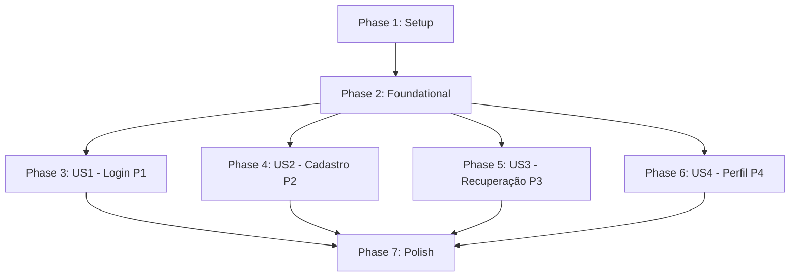

# Tasks: Telas de Autenticação e Perfil do Usuário (SDB-82)

**Branch**: `SDB-82-signin-profile` | **Date**: 2026-10-07 | **Spec**: [spec.md](./spec.md) | **Plan**: [plan.md](./plan.md)

---

## Phase 1: Setup (Shared Infrastructure)

**Purpose**: Inicialização da estrutura de diretórios e contratos de tipos compartilhados.

- [X] T001 Criar diretórios de domínio em `src/pages/auth/` e `src/components/auth/`
- [X] T002 [P] Criar interfaces de autenticação em `src/types/auth.ts` contendo `LoginCredentials`, `RegisterFormData`, `PasswordCriteriaStatus`, `PasswordStrengthLevel` e `PasswordRecoveryState`
- [X] T003 [P] Criar interfaces de perfil em `src/types/userProfile.ts` contendo `UserProfile` (com `planTier: 'MEMBRO PRO'`, `level: 8`, `currentXp: 850`, `nextLevelXp: 1000`), `ActiveTrack`, `ProfileBadge`, `AccountSecurityInfo` e `EditProfileFormData`

---

## Phase 2: Foundational (Blocking Prerequisites)

**Purpose**: Infraestrutura de sessão mockada, proteção de rotas e componentes compartilhados de layout.

**⚠️ CRITICAL**: Nenhuma User Story pode ser iniciada antes da conclusão desta fase.

- [X] T004 Implementar hook de autenticação e sessão em `src/hooks/useAuth.ts` com persistência em `localStorage` (chave `'sidebrain_auth_session'`), usuário padrão mockado `"João Silva"` pré-autenticado, métodos `login()`, `register()` e `logout()`
- [X] T005 [P] Implementar guarda de rotas autenticadas em `src/components/general/PrivateRoute.tsx` consumindo `useAuth` e redirecionando para `"/login"` caso desautenticado
- [X] T006 [P] Implementar painel lateral institucional com variantes de microlearning e IA em `src/components/auth/AuthHeroPanel.tsx` para compor as páginas de Login e Cadastro

**Checkpoint**: Fundação pronta - implementação das User Stories pode prosseguir.

---

## Phase 3: User Story 1 - Acesso à Conta via Tela de Login (Priority: P1) 🎯 MVP

**Goal**: Permitir ao usuário realizar login com feedback visual, alternar visibilidade de senha, marcar "Lembrar de mim", acionar login social demonstrativo e navegar para cadastro e recuperação de senha.

**Independent Test**: Acessar `http://localhost:5173/login`, testar validação de e-mail e senha, alternar olho de senha, marcar lembrar de mim, clicar em entrar e verificar redirecionamento para o Dashboard principal (`/`).

### Implementation for User Story 1

- [X] T007 [P] [US1] Implementar formulário de login em `src/components/auth/LoginForm.tsx` com validação de e-mail obrigatório (`/^[^\s@]+@[^\s@]+\.[^\s@]+$/`), senha obrigatória, toggle de visibilidade de senha, checkbox "Lembrar de mim", botões sociais Google/GitHub e submissão simulada via `useAuth.login()`
- [X] T008 [US1] Implementar página pública de login em `src/pages/auth/LoginPage.tsx` com cabeçalho superior e grid desktop de duas colunas integrando `LoginForm` e `AuthHeroPanel` (variante login) em conformidade com `docs/img/Sidebrain_-_Login_Desktop.png`
- [X] T009 [US1] Configurar rota pública `/login` em `src/App.tsx` e links de navegação para `/cadastro` e `/recuperar-senha`

**Checkpoint**: User Story 1 funcional e testável de forma independente.

---

## Phase 4: User Story 2 - Cadastro de Nova Conta de Estudante (Priority: P2)

**Goal**: Permitir que novos estudantes se cadastrem com validação dinâmica de requisitos de senha (8+ caracteres, 1 número, 1 símbolo) e barra de força em tempo real, checkbox de termos e painel institucional de benefícios.

**Independent Test**: Acessar `http://localhost:5173/cadastro`, digitar senhas de complexidades variadas checando a barra de força e os 3 critérios dinâmicos, testar bloqueio sem marcar termos e submeter para confirmar redirecionamento para o Dashboard (`/`).

### Implementation for User Story 2

- [X] T010 [P] [US2] Implementar indicador dinâmico de força e critérios de senha em `src/components/auth/PasswordStrengthIndicator.tsx` validando `minLength` (>= 8 caracteres), `hasNumber` (`/\d/`) e `hasSymbol` (`/[!@#$%^&*(),.?":{}|<>]/`) com barra em 3 segmentos (Fraca, Média, Forte)
- [X] T011 [US2] Implementar formulário de cadastro em `src/components/auth/RegisterForm.tsx` integrando validação de nome (mínimo 2 caracteres), e-mail válido, `PasswordStrengthIndicator`, checkbox de concordância com Termos de Serviço e Política de Privacidade e submissão via `useAuth.register()`
- [X] T012 [US2] Implementar página pública de cadastro em `src/pages/auth/RegisterPage.tsx` compondo o painel institucional à esquerda (`AuthHeroPanel` com prova social e benefícios de IA) e `RegisterForm` à direita em conformidade com `docs/img/Sidebrain_-_Cadastro_Desktop.png`
- [X] T013 [US2] Configurar rota pública `/cadastro` em `src/App.tsx` e links de retorno para `/login`

**Checkpoint**: User Stories 1 e 2 funcionais e navegáveis entre si.

---

## Phase 5: User Story 3 - Solicitação de Recuperação de Senha (Priority: P3)

**Goal**: Permitir solicitação de redefinição de senha com aviso de expiração de 30 minutos e transição interna para estado dedicado de confirmação visual com o e-mail informado.

**Independent Test**: Acessar `http://localhost:5173/recuperar-senha`, informar e-mail válido, submeter e verificar a transição imediata para a tela de confirmação de envio de instruções, com botão funcional de retorno ao login.

### Implementation for User Story 3

- [X] T014 [P] [US3] Implementar formulário e container de recuperação em `src/components/auth/PasswordRecoveryForm.tsx` com campo de e-mail, box de "Proteção Contínua" (30 min) e transição para estado dedicado de sucesso exibindo o e-mail preenchido e botão para retornar ao login
- [X] T015 [US3] Implementar página pública de recuperação de senha em `src/pages/auth/PasswordRecoveryPage.tsx` com card centralizado, ícone de cadeado e link "Fale com o suporte" em conformidade com `docs/img/Sidebrain_-_Recuperacao_de_Senha_Desktop.png`
- [X] T016 [US3] Configurar rota pública `/recuperar-senha` em `src/App.tsx` e links de retorno para `/login`

**Checkpoint**: Todas as 3 telas públicas de autenticação funcionais e com navegação cruzada completa.

---

## Phase 6: User Story 4 - Visualização e Gerenciamento do Perfil do Usuário (Priority: P4)

**Goal**: Exibir perfil completo de estudante integrado ao layout autenticado com banner de maestria (João Silva, Nível 8, 850/1000 XP), trilhas ativas com botões de retomada para rotas reais, 4 badges em destaque, card de segurança com logout e modal simples de edição em memória.

**Independent Test**: Acessar `http://localhost:5173/perfil`, verificar métricas e trilhas com visual idêntico ao mockup desktop, clicar em "Retomar" na trilha para navegar a `/lessons/1`, testar edição de nome no modal refletindo no banner, e clicar em "Encerrar Sessão" para ser redirecionado para `/login`.

### Implementation for User Story 4

- [X] T017 [P] [US4] Implementar hook de perfil do estudante em `src/hooks/useUserProfile.ts` com dados mockados de João Silva (Nível 8, 850/1000 XP, 2 trilhas ativas, 4 badges, dados de segurança) e método `updateProfile({ name, avatarUrl })`
- [X] T018 [P] [US4] Implementar banner superior de maestria em `src/components/customer/ProfileHeroBanner.tsx` com foto e selo dourado, badge "MEMBRO PRO", nível 8, barra de progresso (850 / 1.000 XP) e botões "Alterar Foto" e "Editar Perfil"
- [X] T019 [P] [US4] Implementar seção de trilhas ativas em `src/components/customer/ActiveTracksSection.tsx` exibindo "Língua Japonesa (N5 Básico)" (40%) e "Matemática do Zero" (65%) com botões "Retomar" navegando para rotas reais (`/lessons/1` e `/lessons/2`)
- [X] T020 [P] [US4] Implementar seção de badges em `src/components/customer/ProfileBadgesSection.tsx` exibindo contagem 4/18 e os cards Fogo Imparável (Raro), Mestre de XP (Épico), Poliglota Curioso (Comum) e Geômetra Iniciante (Incomum)
- [X] T021 [P] [US4] Implementar card lateral de segurança em `src/components/customer/AccountSecurityCard.tsx` com itens de alteração de senha, 2FA, dispositivos ativos e botão "Encerrar Sessão" disparando `useAuth.logout()`
- [X] T022 [P] [US4] Implementar modal interativo simples em `src/components/customer/EditProfileModal.tsx` com backdrop blur, campos para nome e foto/avatar, atualizando o perfil em memória
- [X] T023 [US4] Implementar página "Meu Perfil" em `src/pages/customer/UserProfilePage.tsx` compondo os componentes dentro do layout existente `StudentPageLayout.tsx` em conformidade com `docs/img/Sidebrain_-_Perfil_do_Usuario_Desktop.png`
- [X] T024 [US4] Atualizar menu lateral em `src/components/customer/Sidebar.tsx` habilitando o link para `/perfil` (com ícone ativo) e conectando o botão de rodapé "Sair" ao logout do `useAuth` sem alterar estilos existentes
- [X] T025 [US4] Configurar rota protegida `/perfil` envolvida em `PrivateRoute` em `src/App.tsx`

**Checkpoint**: Perfil totalmente integrado, funcional e protegido.

---

## Phase 7: Polish & Cross-Cutting Concerns

**Purpose**: Verificação de qualidade, integridade de convenções e validação ponta a ponta.

- [X] T026 [P] Validar conformidade de linting e build de produção executando `npm run lint` e `npm run build`
- [X] T027 [P] Garantir que todos os componentes, utilitários, hooks e handlers foram escritos como arrow functions sem ponto e vírgula (;) final conforme `docs/code_conventions.md`
- [X] T028 Executar os 4 cenários de validação manual ponta a ponta descritos em `specs/SDB-82-signin-profile/quickstart.md` confirmando a fidelidade visual pixel-a-pixel com as imagens de referência

---

## Dependencies & Execution Order

### Phase Dependencies

- **Phase 1 (Setup)**: Pode iniciar imediatamente.
- **Phase 2 (Foundational)**: Depende da Phase 1; BLOQUEIA todas as User Stories.
- **Phase 3 a 6 (User Stories)**: Dependem da Phase 2. Podem ser executadas em sequência (P1 → P2 → P3 → P4) ou com tarefas paralelas [P] independentes.
- **Phase 7 (Polish)**: Depende da conclusão de todas as User Stories.

---

## Implementation Strategy

### MVP First (User Story 1 - Login)
1. Concluir Phase 1 (Setup de tipos).
2. Concluir Phase 2 (Foundational: `useAuth`, `PrivateRoute`, `AuthHeroPanel`).
3. Concluir Phase 3 (User Story 1: `LoginForm`, `LoginPage`, rota `/login`).
4. **Validação**: Testar `/login` e redirecionamento para o Dashboard (`/`).

### Entrega Incremental
1. Adicionar US2 (Cadastro) com validação de força de senha e termos.
2. Adicionar US3 (Recuperação de Senha) com transição de confirmação no card.
3. Adicionar US4 (Perfil do Usuário) integrando ao layout existente `StudentPageLayout`, `Sidebar`, trilhas ativas, badges e modal de edição.
4. Concluir Phase 7 com `npm run lint` e `npm run build`.
